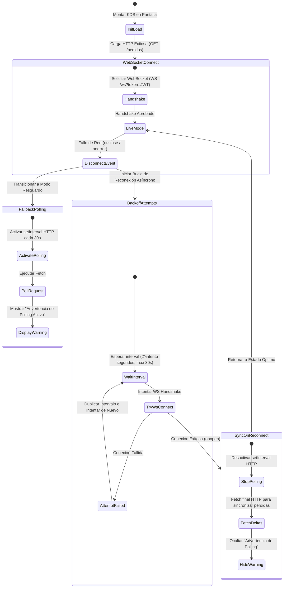

# Technical Design Document: Display de Cocina (KDS) y Rol Cocinero

**ID de Cambio**: `08-display-cocina-kds`  
**Autor**: Senior Software Architect & Tech Lead  
**Estado**: Diseñado (`design`)  

---

## 1. Introducción y Objetivos de Diseño

El Kitchen Display System (KDS) representa una pieza fundamental para la maduración operativa de la plataforma de Food Store. Este módulo conecta el flujo transaccional de compras (el checkout del cliente) directamente con la consola de producción física en cocina mediante un canal reactivo de ultra-baja latencia y alta resiliencia.

### Objetivos Principales:
1. **Reactividad en Tiempo Real**: Notificar instantáneamente a la cocina al confirmarse un pago, eliminando el delay operativo de polling HTTP constante en condiciones de red estables.
2. **Seguridad y Control de Acceso Estricto (RBAC)**: Introducir el rol `cocina` con permisos fuertemente acotados a su área de trabajo operativa, evitando manipulaciones accidentales de otros aspectos del negocio (facturación, envíos, administración de usuarios).
3. **Robustez y Resiliencia**: Garantizar que el KDS siga funcionando mediante un mecanismo híbrido (WebSocket + Polling de resguardo con reconexión de backoff exponencial) aun frente a caídas temporales de red o reinicios de contenedores en el backend.
4. **Inmutabilidad y Auditoría**: Registrar con precisión quirúrgica el operario (Cocinero/Admin) responsable de cada transición de estado en la máquina de estados del pedido.

---

## 2. Diseño de Base de Datos y Seguridad (RBAC)

### 2.1 Cambios en Modelos SQLModel
Para soportar el nuevo rol operativo y controlar la disponibilidad instantánea de ítems, se incorporan las siguientes extensiones en las clases de SQLModel:

#### A. Inclusión del Rol en `backend/app/db/models/usuario.py`:
```python
# Modificación en RolEnum
class RolEnum(str, Enum):
    ADMIN = "admin"
    STOCK = "stock"
    PEDIDOS = "pedidos"
    CLIENT = "client"
    COCINA = "cocina"  # <-- NUEVO miembro de enum
```

#### B. Columna de Disponibilidad Temporal en `backend/app/db/models/producto.py`:
```python
class Producto(BaseModel, table=True):
    __tablename__ = "productos"
    
    # [Campos existentes...]
    activo: bool = Field(default=True, description="Whether product is available for sale")
    
    # Nuevo campo para apagado temporal en cocina sin afectar inventario físico ni desactivar el producto del sistema
    disponible: bool = Field(
        default=True, 
        sa_column=Column(Boolean, nullable=False, server_default="true"),
        description="Disponibilidad inmediata para la venta gestionada desde la cocina"
    )
```

### 2.2 Migración de Base de Datos (Alembic)
Generaremos una migración de Alembic para inyectar de forma segura la nueva columna `disponible` en la tabla `productos` y el rol en las restricciones de base de datos si fuera necesario:

```python
"""add disponible column to productos

Revision ID: 08_display_cocina_kds
Revises: b2c3d4e5f6a7
Create Date: 2026-05-21 09:45:00.000000
"""
from alembic import op
import sqlalchemy as sa

# revision identifiers, used by Alembic.
revision = '08_display_cocina_kds'
down_revision = 'b2c3d4e5f6a7'
branch_labels = None
depends_on = None

def upgrade() -> None:
    # 1. Agregar columna disponible con server_default para pedidos en producción
    op.add_column(
        'productos',
        sa.Column('disponible', sa.Boolean(), nullable=False, server_default=sa.text('true'))
    )
    # 2. Agregar índice para optimización de queries del catálogo
    op.create_index('idx_productos_disponible', 'productos', ['disponible'])

def downgrade() -> None:
    op.drop_index('idx_productos_disponible', table_name='productos')
    op.drop_column('productos', 'disponible')
```

### 2.3 Sembrado de Datos Idempotente (Seed Integration)
Modificamos `backend/app/db/seed.py` para asegurar que el rol `"cocina"` y el usuario `"cocina@foodstore.com"` existan de forma consistente al inicializar o resetear la base de datos de desarrollo y testing.

```python
# backend/app/db/seed.py - Modificación en seed_database()

# 1. Extender los roles_data para incorporar el rol cocina
roles_data = [
    {"nombre": "admin", "descripcion": "Administrador con acceso completo al sistema"},
    {"nombre": "stock", "descripcion": "Gestión de catálogo, productos e ingredientes"},
    {"nombre": "pedidos", "descripcion": "Gestión y seguimiento de pedidos"},
    {"nombre": "client", "descripcion": "Cliente registrado del e-commerce"},
    {"nombre": "cocina", "descripcion": "Operación de cocina: recibe pedidos confirmados y gestiona su preparación"},  # <-- NUEVO
]

# 2. Inyección del usuario cocinero de prueba de forma idempotente
cocina_email = "cocina@foodstore.com"
cocina_result = await session.execute(
    select(Usuario).where(Usuario.email == cocina_email)
)
existing_cocina = cocina_result.scalars().first()

if not existing_cocina:
    cocina_user = Usuario(
        email=cocina_email,
        nombre="Cocinero",
        apellido="Principal",
        hashed_password=get_password_hash("password"),  # password de desarrollo
        numero_telefono="+5491100000000",
        activo=True,
        verificado=True,
        created_at=datetime.utcnow(),
        updated_at=datetime.utcnow()
    )
    session.add(cocina_user)
    await session.flush()

    # Resolver rol_id de 'cocina'
    rol_cocina_result = await session.execute(
        select(Rol).where(Rol.nombre == "cocina")
    )
    rol_cocina = rol_cocina_result.scalars().first()
    
    usuario_rol = UsuarioRol(
        usuario_id=cocina_user.id,
        rol_id=rol_cocina.id
    )
    session.add(usuario_rol)
    await session.flush()
    print(f"✓ Created cocina user: {cocina_email}")
else:
    print(f"✓ Cocina user already exists: {cocina_email}")
```

### 2.4 Control de Accesos y Seguridad en Endpoints
FastAPI provee `Depends(require_role([...]))` para verificar la posesión de roles en endpoints tradicionales HTTP.
Para soportar el KDS, definimos la autorización con el rol minúscula `"cocina"`, manteniéndonos alineados a la estructura de la base de datos de Food Store.

```python
# backend/app/modules/auth/router.py - require_role ya soporta listas de roles permitidos.
# El middleware resolverá los roles en minúsculas. Usaremos:
require_cocina_or_admin = require_role(["cocina", "pedidos", "admin"])
require_stock_or_cocina = require_role(["cocina", "stock", "admin"])
```

---

## 3. Diseño Estructural del Backend (FastAPI & WebSockets)

### 3.1 Gestor de Conexiones Concurrente (`ConnectionManager`)
La persistencia de múltiples WebSockets activos requiere un control de acceso estrictamente concurrente e inmune a race conditions. La clase `ConnectionManager` implementa `asyncio.Lock` para serializar la mutación y lectura de sockets activos durante handshakes y broadcasts masivos.

```python
# backend/app/modules/cocina/service.py
import asyncio
import logging
from typing import Set, Dict, Any
from fastapi import WebSocket

logger = logging.getLogger(__name__)

class ConnectionManager:
    """Manages active WebSocket connections for the Kitchen Display System (KDS) with concurrent safety."""

    def __init__(self):
        # Set de WebSockets activos en memoria
        self.active_connections: Set[WebSocket] = set()
        self.lock = asyncio.Lock()

    async def connect(self, websocket: WebSocket):
        """Accepts and registers a new WebSocket connection thread-safely."""
        await websocket.accept()
        async with self.lock:
            self.active_connections.add(websocket)
        logger.info(f"KDS WebSocket client connected. Active connections: {len(self.active_connections)}")

    async def disconnect(self, websocket: WebSocket):
        """Deregisters a WebSocket connection thread-safely."""
        async with self.lock:
            if websocket in self.active_connections:
                self.active_connections.remove(websocket)
        logger.info(f"KDS WebSocket client disconnected. Active connections: {len(self.active_connections)}")

    async def broadcast(self, message: Dict[str, Any]):
        """Broadcasts a JSON payload to all connected KDS displays concurrently and safely."""
        async with self.lock:
            # Hacemos una copia local para evitar RuntimeError: set size changed during iteration
            connections = list(self.active_connections)
        
        if not connections:
            return

        # Creamos tareas asíncronas concurrentes para enviar los mensajes a todos los displays
        tasks = [self._send_json_safe(connection, message) for connection in connections]
        await asyncio.gather(*tasks, return_exceptions=True)

    async def _send_json_safe(self, websocket: WebSocket, message: Dict[str, Any]):
        """Sends JSON safely. Automatically disconnects the socket if an exception occurs."""
        try:
            await websocket.send_json(message)
        except Exception as e:
            logger.warning(f"Error sending payload through WebSocket. Disconnecting stale socket. Detail: {e}")
            await self.disconnect(websocket)

# Singleton global para uso en la aplicación
cocina_ws_manager = ConnectionManager()
```

### 3.2 Endpoints y Enrutamiento (`backend/app/modules/cocina/router.py`)
Definimos los contratos e interfaces HTTP y WebSocket en un router dedicado. El WebSocket interceptará el token en el handshake de la URL de conexión.

```python
# backend/app/modules/cocina/router.py
from fastapi import APIRouter, Depends, HTTPException, status, WebSocket, WebSocketDisconnect, Query
from sqlalchemy.ext.asyncio import AsyncSession
from typing import List, Optional

from app.core.dependencies import get_db
from app.modules.auth.router import get_current_user, require_role
from app.modules.auth.service import AuthService
from app.modules.auth.schemas import UserResponse
from app.modules.cocina.service import cocina_ws_manager
from app.modules.pedidos.service import PedidoService
from app.modules.pedidos.schemas import PedidoResponse, PedidoListResponse
from app.db.models.pedido import EstadoPedido
from app.db.models.producto import Producto
from sqlmodel import select

router = APIRouter(prefix="/cocina", tags=["cocina"])

# 1. GET /api/v1/cocina/pedidos
@router.get(
    "/pedidos",
    response_model=List[PedidoListResponse],
    status_code=status.HTTP_200_OK,
    summary="Get active kitchen orders (confirmado and en_preparacion)"
)
async def get_cocina_pedidos(
    estado: Optional[str] = Query(None, description="Filtrar por 'confirmado' o 'en_preparacion'"),
    session: AsyncSession = Depends(get_db),
    current_user: UserResponse = Depends(require_role(["cocina", "pedidos", "admin"]))
):
    """
    Recupera los pedidos en cola de producción para la cocina.
    Ordenados cronológicamente por el momento de confirmación (el más antiguo primero).
    """
    # Mapeo a los nombres reales de la BD
    allowed_states = ["confirmado", "en_preparacion"]
    if estado:
        if estado not in allowed_states:
            raise HTTPException(status_code=400, detail="Estado inválido. Debe ser 'confirmado' o 'en_preparacion'")
        allowed_states = [estado]

    # Ejecutar consulta optimizada
    pedido_service = PedidoService(session)
    # Recuperamos todos los pedidos y los filtramos/ordenamos
    pedidos = []
    for state_name in allowed_states:
        state_pedidos = await pedido_service.get_pedidos(current_user.id, is_admin=True, estado=state_name)
        pedidos.extend(state_pedidos)
        
    # Ordenar por antigüedad (created_at de forma ascendente: FIFO)
    pedidos.sort(key=lambda x: x.created_at)
    
    # Mapeo simple a PedidoListResponse
    result = []
    for p in pedidos:
        # Resolver el nombre real del estado
        estado_nombre = "confirmado"
        for h in p.historial_estados:
            if h.estado_id == p.estado_id:
                estado_nombre = h.estado.nombre
                break
        
        result.append(
            PedidoListResponse(
                id=p.id,
                numero_pedido=p.numero_pedido,
                estado_nombre=estado_nombre,
                total=p.total,
                created_at=p.created_at
            )
        )
    return result

# 2. PATCH /api/v1/cocina/productos/{id}/disponibilidad
@router.patch(
    "/productos/{producto_id}/disponibilidad",
    status_code=status.HTTP_200_OK,
    summary="Toggle product availability temporarily"
)
async def toggle_producto_disponibilidad(
    producto_id: int,
    disponible: bool,
    session: AsyncSession = Depends(get_db),
    current_user: UserResponse = Depends(require_role(["cocina", "stock", "admin"]))
):
    """
    Permite desactivar o activar temporalmente un producto del menú debido a falta de stock
    de ingredientes o saturación del servicio, sin alterar el stock numérico real.
    """
    result = await session.execute(select(Producto).where(Producto.id == producto_id))
    producto = result.scalars().first()
    if not producto:
        raise HTTPException(status_code=404, detail="Producto no encontrado")
        
    producto.disponible = disponible
    await session.commit()
    await session.refresh(producto)
    
    return {
        "id": producto.id,
        "nombre": producto.nombre,
        "disponible": producto.disponible,
        "activo": producto.activo
    }

# 3. WS /api/v1/cocina/ws
@router.websocket("/ws")
async def cocina_ws_endpoint(
    websocket: WebSocket,
    token: Optional[str] = Query(None),
    session: AsyncSession = Depends(get_db)
):
    """
    Handshake de WebSocket autenticado por JWT mediante query parameter 'token'.
    Valida firma, expiración y RBAC.
    """
    if not token:
        logger.warning("WS connection rejected: token query parameter missing.")
        await websocket.close(code=status.WS_1008_POLICY_VIOLATION, reason="Token is required")
        return

    auth_service = AuthService(session)
    try:
        # Decodificación y validación de seguridad nativa
        usuario = await auth_service.get_current_user(token)
        roles = await auth_service.get_user_roles(usuario.id)
        
        if not any(r in ["cocina", "pedidos", "admin"] for r in roles):
            logger.warning(f"WS connection rejected: user {usuario.email} lacks kitchen permissions. Roles: {roles}")
            await websocket.close(code=status.WS_1008_POLICY_VIOLATION, reason="Not enough permissions")
            return
            
    except ValueError as e:
        logger.warning(f"WS connection rejected due to invalid token: {e}")
        await websocket.close(code=status.WS_1008_POLICY_VIOLATION, reason="Invalid credentials")
        return

    # Registrar conexión de forma segura en memoria concurrente
    await cocina_ws_manager.connect(websocket)
    try:
        # Loop infinito para mantener viva la conexión recibiendo pings/mensajes si el cliente envía
        while True:
            # Los cocineros solo leen eventos, no envían comandos por WS en la v1
            data = await websocket.receive_text()
            # Opcional: procesar latidos o heartbeats de clientes
    except WebSocketDisconnect:
        await cocina_ws_manager.disconnect(websocket)
    except Exception as e:
        logger.error(f"WebSocket error in cocina endpoint: {e}")
        await cocina_ws_manager.disconnect(websocket)
```

### 3.3 Transiciones de FSM y Auditoría en `backend/app/modules/pedidos/service.py`
Para cumplir con **US-COCINA-03**, modificamos la lógica del método `avanzar_estado` para restringir el alcance transaccional cuando el usuario tiene **únicamente** el rol `"cocina"`. Asimismo, se registra de manera auditable el `usuario_id` del operario en la tabla `HistorialEstadoPedido`.

```python
# backend/app/modules/pedidos/service.py - Delta de código para avanzar_estado()

# Modificamos la firma para aceptar la lista de roles del usuario autenticado
async def avanzar_estado(
    self,
    pedido_id: int,
    nuevo_estado_nombre: str,
    usuario_id: int,
    usuario_roles: list[str],  # <-- NUEVO: Inyección de roles del operario
    nota: Optional[str] = None,
) -> Pedido:
    """Advance the order's FSM state. Validates transition, role constraints, and audits."""
    pedido = await self._get_pedido(pedido_id)

    # 1. Resolver el nombre del estado actual del pedido
    result = await self.session.execute(
        select(EstadoPedido).where(EstadoPedido.id == pedido.estado_id)
    )
    estado_actual = result.scalars().first()
    if not estado_actual:
        raise ValueError("Estado actual del pedido no encontrado.")

    # 2. RBAC Guard: Restricciones de Cocina (RN-CO03)
    # Si el usuario tiene rol 'cocina' pero NO tiene 'admin' ni 'pedidos'
    es_solo_cocina = "cocina" in usuario_roles and not any(r in ["admin", "pedidos"] for r in usuario_roles)
    
    if es_solo_cocina:
        # El cocinero solo puede realizar transiciones específicas
        # Mapeando: confirmado -> en_preparacion (iniciar prep) y en_preparacion -> en_camino (listo para despacho)
        transicion_valida = (
            (estado_actual.nombre == "confirmado" and nuevo_estado_nombre == "en_preparacion") or
            (estado_actual.nombre == "en_preparacion" and nuevo_estado_nombre == "en_camino")
        )
        if not transicion_valida:
            raise PermissionError(
                f"Transición '{estado_actual.nombre} -> {nuevo_estado_nombre}' no autorizada para el rol Cocina. "
                "Solo se permite: 'confirmado -> en_preparacion' o 'en_preparacion -> en_camino'."
            )

    # 3. Validar FSM General
    allowed = FSM_TRANSITIONS.get(estado_actual.nombre, set())
    if nuevo_estado_nombre not in allowed:
        raise ValueError(
            f"Transición inválida: {estado_actual.nombre} → {nuevo_estado_nombre}. "
            f"Transiciones permitidas: {allowed or 'ninguna'}."
        )

    nuevo_estado = await self._get_estado(nuevo_estado_nombre)

    # 4. Descontar stock si pasa a confirmado (Lógica existente)
    if nuevo_estado_nombre == "confirmado":
        result_det = await self.session.execute(
            select(DetallePedido).where(DetallePedido.pedido_id == pedido_id)
        )
        detalles = result_det.scalars().all()
        for detalle in detalles:
            result_prod = await self.session.execute(
                select(Producto)
                .where(Producto.id == detalle.producto_id)
                .with_for_update()
            )
            producto = result_prod.scalars().first()
            if not producto or producto.stock < detalle.cantidad:
                pname = producto.nombre if producto else f"ID #{detalle.producto_id}"
                raise ValueError(
                    f"Stock insuficiente para confirmar el pedido. Producto '{pname}' sin stock."
                )
            producto.stock -= detalle.cantidad

    # 5. Aplicar Transición
    pedido.estado_id = nuevo_estado.id
    pedido.updated_at = datetime.utcnow()

    # 6. Inserción de Auditoría registrando el usuario_id del operador (Cocinero/Admin/Pedidos)
    historial = HistorialEstadoPedido(
        pedido_id=pedido.id,
        estado_id=nuevo_estado.id,
        usuario_id=usuario_id,  # Operario autenticado
        nota=nota or f"Transición de estado ejecutada por operador (Rol: {', '.join(usuario_roles)})",
        fecha_cambio=datetime.utcnow(),
        created_at=datetime.utcnow(),
        updated_at=datetime.utcnow(),
    )
    self.session.add(historial)
    await self.session.flush()

    # 7. Broadcast de Eventos en Tiempo Real hacia el ConnectionManager (US-COCINA-04)
    # Armamos el payload estructurado
    # Para notificaciones robustas de nuevo pedido confirmado, pasamos el objeto serializado
    event_type = f"PEDIDO_{nuevo_estado_nombre.upper()}"
    if nuevo_estado_nombre == "en_preparacion":
        event_type = "PEDIDO_EN_PREPARACION"
    elif nuevo_estado_nombre == "en_camino":
        event_type = "PEDIDO_EN_CAMINO"

    # Mapeo de detalles para KDS
    detalles_kds = []
    result_det = await self.session.execute(
        select(DetallePedido).where(DetallePedido.pedido_id == pedido_id)
    )
    detalles = result_det.scalars().all()
    for d in detalles:
        detalles_kds.append({
            "nombre_snapshot": d.nombre_snapshot,
            "cantidad": d.cantidad,
            "personalizacion": d.personalizacion or []
        })

    ws_payload = {
        "event": event_type,
        "data": {
            "id": pedido.id,
            "numero_pedido": pedido.numero_pedido,
            "created_at": pedido.created_at.isoformat() + "Z",
            "notas": pedido.notas,
            "estado_codigo": nuevo_estado_nombre,
            "detalles": detalles_kds
        }
    }

    # Disparar broadcast concurrente no bloqueante
    from app.modules.cocina.router import cocina_ws_manager
    asyncio.create_task(cocina_ws_manager.broadcast(ws_payload))

    return pedido
```

---

## 4. Diseño Modular en el Frontend (FSD)

Siguiendo de forma rigurosa la metodología **Feature-Sliced Design (FSD)** en `frontend/src/`, organizamos y aislamos los elementos funcionales e interfaces de cocina:

```
frontend/src/
├── app/
│   └── routes/
│       └── router.tsx             # Ruta '/cocina' protegida por rol "cocina", "pedidos", "admin"
├── pages/
│   └── cocina/
│       └── CocinaPage.tsx         # Layout KDS de pantalla completa con grilla de columnas
├── features/
│   └── cocina/
│       ├── api/
│       │   └── cocinaApi.ts       # Consultas Axios para obtener pedidos activos y disponibilidad de ítems
│       ├── hooks/
│       │   └── useKdsSocket.ts    # Orquestador principal de WebSocket + Polling con backoff exponencial
│       ├── components/
│       │   ├── KdsCard.tsx        # Ficha del pedido individual con timer visual interactivo
│       │   ├── KdsColumn.tsx      # Estructurador de columnas ("Por preparar" / "En preparación")
│       │   └── SoundToggle.tsx    # Toggle de encendido de alerta sonora persistido en localStorage
│       └── utils/
│           └── audioAlert.ts      # Generador sintético de alertas con Web Audio API (campana programática)
```

### 4.1 UI del KDS y Gestión de Timers (`CocinaPage.tsx`)
El layout de cocina utiliza una división de **dos columnas principales** con scroll independiente y asignación de prioridades FIFO.
Cada pedido contiene un componente `KdsCard` que renderiza un cronómetro en tiempo real utilizando un `setInterval` interno reactivo cada 15 segundos para alertar visualmente al cocinero sobre la urgencia:

*   **Menos de 10 minutos (Espera óptima)**: Fondo blanco o gris neutro.
*   **Entre 10 y 20 minutos (Espera intermedia)**: Fondo naranja cálido (`bg-orange-50 border-orange-400 text-orange-900`) con sutil alerta.
*   **Más de 20 minutos (Demora crítica)**: Fondo rojo suave con animación pulsante (`bg-red-50 border-red-400 text-red-900 animate-pulse`), reclamando foco operativo inmediato.

### 4.2 Sintetizador Programático de Sonido (Web Audio API)
Para evitar retrasos de red o fallos al cargar archivos estáticos binarios (como `.mp3` o `.wav`) y optimizar la reactividad, implementamos una alerta acústica sintetizada de forma programática. El sonido simula una campana de restaurante de dos tonos mediante la superposición armónica de un oscilador senoidal en **D5** y un oscilador triangular en **A5**, aplicando decaimiento exponencial del volumen sobre un nodo de ganancia durante 0.6 segundos.

```typescript
// features/cocina/utils/audioAlert.ts

let audioCtx: AudioContext | null = null;

/**
 * Plays a programmatically synthesized bell chime using Web Audio API.
 * Synthesizes a beautiful chord with frequencies D5 (587.33 Hz) and A5 (880.00 Hz).
 * Includes exponential volume decay for a natural acoustic fade.
 */
export const playIncomingOrderSound = (): void => {
  // 1. Guard de preferencia del usuario persistida en localStorage
  const isSoundEnabled = localStorage.getItem("kds_sound_enabled") !== "false";
  if (!isSoundEnabled) return;

  try {
    // 2. Inicialización perezosa de AudioContext (evita bloqueos de autoplay de navegadores)
    if (!audioCtx) {
      audioCtx = new (window.AudioContext || (window as any).webkitAudioContext)();
    }

    // 3. Reanudar contexto si está suspendido por políticas de seguridad del host
    if (audioCtx.state === "suspended") {
      audioCtx.resume();
    }

    const now = audioCtx.currentTime;

    // 4. Creación de nodos osciladores y ganancia
    const osc1 = audioCtx.createOscillator();
    const osc2 = audioCtx.createOscillator();
    const gainNode = audioCtx.createGain();

    // 5. Cableado de la ruta de audio: Osciladores -> Ganancia -> Bocinas
    osc1.connect(gainNode);
    osc2.connect(gainNode);
    gainNode.connect(audioCtx.destination);

    // 6. Diseño acústico: Tono base armónico (D5 - Senoidal)
    osc1.type = "sine";
    osc1.frequency.setValueAtTime(587.33, now); // 587.33 Hz (Nota D5)

    // 7. Tono secundario complementario para textura metálica (A5 - Triangular)
    osc2.type = "triangle";
    osc2.frequency.setValueAtTime(880.00, now); // 880.00 Hz (Nota A5)

    // 8. Envolvente de volumen exponencial (Exponential Decay)
    // Volumen inicial agradable para evitar saturación (0.15 de ganancia)
    gainNode.gain.setValueAtTime(0.15, now);
    // Rampa descendente ultra suave hacia el silencio (0.001) en 0.6 segundos
    gainNode.gain.exponentialRampToValueAtTime(0.001, now + 0.6);

    // 9. Ejecución de la síntesis
    osc1.start(now);
    osc2.start(now);
    
    // Apagado automático de los hilos de audio para liberar hardware y RAM del navegador
    osc1.stop(now + 0.6);
    osc2.stop(now + 0.6);
  } catch (error) {
    console.warn("Could not play kitchen notification chime: Web Audio API error: ", error);
  }
};
```

---

## 5. Resiliencia, Fallback de Polling y Reconexión

Para blindar la cocina ante interrupciones físicas del router o caídas de contenedores backend, se implementa un bucle de vida asíncrono con **Modo Fallback por Polling HTTP**.

Si la conexión en vivo mediante WebSocket se corta:
1. El KDS activa de manera automática y silenciosa un temporizador de **Polling HTTP**, solicitando la lista a `GET /api/v1/cocina/pedidos` de forma recursiva cada 30 segundos.
2. Simultáneamente, el display muestra una alerta discreta en pantalla: *"Conexión en vivo perdida - Modo de resguardo (Polling activo)"*.
3. En segundo plano, se inician reintentos de reconexión del WebSocket mediante un algoritmo de **Backoff Exponencial**:
   - Primer reintento a los 2 segundos.
   - Segundo a los 4 segundos.
   - Tercer a los 8 segundos.
   - Incremento geométrico progresivo hasta estabilizarse en un tope de 30 segundos entre intentos.
4. Al recuperar con éxito el canal WebSocket, la alerta visual se elimina, el Polling HTTP de respaldo se detiene y se dispara una carga final HTTP asíncrona para asegurar que no se haya omitido ningún evento de cocina durante el período de desconexión.

### Diagrama de Transición de Estados de Conexión (Mermaid)



---

## 6. Plan de Verificación Técnica (Strict TDD Mode)

Como este repositorio corre bajo la bandera de **Strict TDD Mode**, no se escribirá código funcional hasta que las pruebas unitarias y de integración de backend estén debidamente programadas en `backend/app/tests/modules/cocina/test_cocina.py` y demuestren fallas iniciales controladas (Red State).

### 6.1 Tests de Integración Backend (Pytest)

Las pruebas automatizadas cubrirán de forma explícita:

1.  **Seguridad y Handshake de WebSocket**:
    - Verificar que la conexión a `WS /api/v1/cocina/ws` sin token JWT sea rechazada de forma inmediata con un código de política violada (WS 1008).
    - Verificar que un usuario con token JWT con rol exclusivo de `"client"` no sea admitido en la conexión.
    - Probar que un usuario con rol `"cocina"` sea aceptado correctamente y se registre la sesión.
2.  **Seguridad en Rutas REST (RBAC)**:
    - Hacer un `GET /api/v1/cocina/pedidos` con un token del rol `"client"` y validar el retorno estricto de **HTTP 403 Forbidden**.
    - Hacer un `PATCH /api/v1/cocina/productos/{id}/disponibilidad` sin cabecera de autenticación y verificar el retorno de **HTTP 401 Unauthorized**.
3.  **Transiciones en la Máquina de Estados (FSM)**:
    - Crear un pedido de prueba en estado `"confirmado"`.
    - Simular un avance de estado a `"en_preparacion"` operado por un usuario con rol `"cocina"`. Verificar que el pedido evolucione en base de datos.
    - Comprobar que en la tabla `HistorialEstadoPedido` se registre el `usuario_id` exacto del cocinero.
    - Intentar avanzar el estado de `"en_preparacion"` directamente a `"entregado"` con el rol `"cocina"`. Validar que el backend retorne **HTTP 403 Forbidden** y el pedido mantenga inalterado su estado.
4.  **Emisión de Eventos en Tiempo Real**:
    - Abrir un WebSocket de prueba contra la API.
    - Ejecutar la transición de un pedido a `"en_preparacion"` a través del cliente HTTP tradicional.
    - Leer el socket de prueba y verificar que se reciba el payload JSON estructurado con el tag `PEDIDO_EN_PREPARACION` y el ID del pedido correspondiente.
