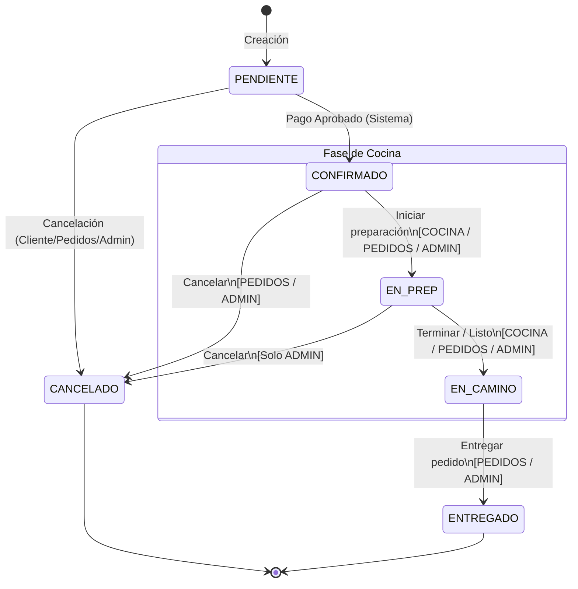

# Proposal: Display de Cocina (KDS) y Nuevo Rol Cocinero

**ID de Cambio**: `08-display-cocina-kds`  
**Autor**: Senior Tech Lead & Software Architect  
**Estado**: Bajo Revisión (`propose`)  

> [!NOTE]  
> Este documento detalla la propuesta técnica para incorporar el Kitchen Display System (KDS) y el rol `COCINA` en la plataforma Food Store. Este feature cubre desde el soporte en base de datos y FSM en backend hasta la UI en tiempo real resiliente utilizando React y WebSockets.

---

## 1. User Review Required & Breaking Changes

> [!WARNING]  
> **Cambios de Compatibilidad y Base de Datos (Breaking Changes):**  
> 1. **Delta de Enum en Modelos Existentes:** Se modifica `RolEnum` en `backend/app/db/models/usuario.py` agregando la opción `COCINA = "cocina"`. Si bien no rompe esquemas existentes, requiere una migración de datos o recarga del seed para que la tabla `Rol` y la tabla pivote de roles se actualicen.
> 2. **Delta en Flujo de Estados (FSM):** Se restringe el avance de estados en `PedidoService.avanzar_estado` según el rol. El rol `COCINA` recibirá un error **HTTP 403 (Forbidden)** si intenta realizar cualquier transición fuera de `CONFIRMADO → EN_PREP` o `EN_PREP → EN_CAMINO`. Esto refina el control de accesos a nivel de servicio.
> 3. **Handshake de WebSocket con Autenticación:** Se requiere el paso de JWT token a través de query params (`token=<JWT>`) en el handshake de la conexión WebSocket para verificar la autenticación del Cocinero/Admin.

---

## 2. Modelo de Datos y Seguridad (RBAC)

### 2.1 Modelo de Datos (Delta en Catálogos)
La versión `v1` **no requiere nuevas tablas en la base de datos**, lo cual reduce el riesgo de acoplamiento. Reutilizaremos de forma óptima los recursos del modelo de datos actual:
- **Identificación de Pedidos de Cocina:** Filtro por `estado_codigo IN ('CONFIRMADO', 'EN_PREP')`.
- **Timer de Urgencia:** Usaremos el timestamp `created_at` del registro `estado_hasta = CONFIRMADO` en `HistorialEstadoPedido` para saber el momento exacto en el que el pedido ingresó en la cola de producción.
- **Detalle de Ítems:** `DetallePedido` con `nombre_snapshot`, `cantidad` y `subtotal`.
- **Exclusión de Alérgenos / Personalización:** `DetallePedido.personalizacion` (lista de ingredientes excluidos).
- **Notas de Cliente:** `Pedido.notas`.
- **Disponibilidad de Productos:** Columna `Producto.disponible` (BOOLEAN) para el apagado temporal.

### 2.2 Sembrado (Seed) y Roles
Actualizaremos `backend/app/db/seed.py` para asegurar de forma idempotente:
1. La inserción del rol `COCINA`:
   ```sql
   INSERT INTO rol (codigo, nombre, descripcion) 
   VALUES ('cocina', 'Cocinero', 'Operación de cocina: recibe pedidos confirmados y gestiona su preparación')
   ON CONFLICT (codigo) DO NOTHING;
   ```
2. La creación del usuario de prueba `cocina@foodstore.com` con contraseña `password` y su vinculación al rol `cocina`.

### 2.3 Seguridad y Autorización
Se integrará la dependencia `require_role(["COCINA", "PEDIDOS", "ADMIN"])` en los endpoints de cocina.
Además, se codificará en la capa de servicios (`PedidoService.avanzar_estado`) una validación estricta de transiciones basada en roles para cumplir con **RN-CO03**:
- Si el usuario logueado tiene **únicamente** el rol `COCINA`, el backend verificará el cambio solicitado:
  - Permitido: `CONFIRMADO → EN_PREP` (iniciar preparación).
  - Permitido: `EN_PREP → EN_CAMINO` (terminar preparación).
  - Cualquier otro cambio: **HTTP 403 Forbidden** con mensaje `"Transición de estado no autorizada para el rol Cocina"`.
- Los roles `PEDIDOS` y `ADMIN` retienen sus capacidades completas de transición y cancelación.



---

## 3. Arquitectura de Tiempo Real (WebSockets vs SSE)

### 3.1 Análisis Técnico y Tradeoffs
Para notificar al KDS en tiempo real sobre pedidos nuevos o modificados, evaluamos dos alternativas:

| Criterio | Server-Sent Events (SSE) | WebSockets (WS) |
| :--- | :--- | :--- |
| **Dirección** | Unidireccional (Server → Client) | Bidireccional (Server ↔ Client) |
| **Protocolo** | HTTP estándar (Text/Event-Stream) | Upgrade de HTTP a WS (Protocolo propio) |
| **Complejidad** | Muy baja. Soporte nativo para reconexión. | Media-Alta. Requiere manejo manual de reconexión. |
| **Resiliencia** | Alta, gestionada por el navegador. | Media, requiere lógica de latidos (Heartbeat) y reconexión. |
| **Uso de Recursos** | Bajo. Mantiene sockets HTTP abiertos. | Bajo-Medio. Requiere mantener conexiones TCP full-duplex. |

### 3.2 Decisión de Arquitectura: WebSockets con Fallback de Polling Resiliente
Seleccionamos **WebSockets** como el mecanismo principal para habilitar la reactividad en tiempo real del KDS. Esto se debe a que la historia **US-COCINA-01** y los requerimientos futuros de bidireccionalidad (como chats de cocina, confirmaciones instantáneas bidireccionales, o llamadas a reparto) se benefician del canal full-duplex directo.

**Mecanismo de Resiliencia (US-COCINA-08):**
Para garantizar la continuidad operativa de la cocina ante caídas de red:
1. **Estado Inicial:** Al montar la pantalla del KDS, se realiza una petición HTTP `GET /api/v1/cocina/pedidos` para recuperar el estado inicial limpio.
2. **Conexión Live:** Inmediatamente se abre la conexión WebSocket en `WS /api/v1/cocina/ws?token=<JWT>`.
3. **Pérdida de Conexión:** Si el WebSocket se desconecta (evento `onclose`), el KDS activa instantáneamente el **Modo de Respaldo por Polling**, realizando un fetch completo a `GET /api/v1/cocina/pedidos` cada 30 segundos, mostrando una alerta visual discreta de *"Conexión en vivo perdida - Polling activo"*.
4. **Reconexión Automática:** El KDS intentará reconectar el WebSocket en segundo plano usando un algoritmo de *backoff exponencial* (arrancando en 2s, duplicando hasta un tope de 30s). Al reconectar con éxito, el KDS vuelve al modo push y realiza una última carga HTTP para sincronizar cualquier evento omitido durante la desconexión.

---

## 4. Diseño del Backend y Endpoints API

### 4.1 Gestor de Conexiones en Memoria (`ConnectionManager`)
Dado que v1 corre en un entorno de **única instancia**, implementamos un pub/sub en memoria robusto y concurrente usando `asyncio.Lock` para evitar race conditions al conectar, desconectar y difundir mensajes.

```python
import asyncio
from fastapi import WebSocket
from typing import Set

class ConnectionManager:
    def __init__(self):
        self.active_connections: Set[WebSocket] = set()
        self.lock = asyncio.Lock()

    async def connect(self, websocket: WebSocket):
        await websocket.accept()
        async with self.lock:
            self.active_connections.add(websocket)

    async def disconnect(self, websocket: WebSocket):
        async with self.lock:
            if websocket in self.active_connections:
                self.active_connections.remove(websocket)

    async def broadcast(self, message: dict):
        async with self.lock:
            # Creamos una copia para evitar race conditions si conexiones cambian durante la iteración
            connections = list(self.active_connections)
        
        if not connections:
            return

        # Difusión concurrente con safe error-handling
        tasks = []
        for connection in connections:
            tasks.append(self._send_json_safe(connection, message))
        await asyncio.gather(*tasks, return_exceptions=True)

    async def _send_json_safe(self, websocket: WebSocket, message: dict):
        try:
            await websocket.send_json(message)
        except Exception:
            # Si falla el envío (conexión rota no detectada), desconectamos silenciosamente
            await self.disconnect(websocket)

manager = ConnectionManager()
```

### 4.2 Endpoints REST y Rutas de Cocina

#### 1. Obtener Pedidos Activos de Cocina
* **Ruta:** `GET /api/v1/cocina/pedidos`
* **Autorización:** `require_role(["COCINA", "PEDIDOS", "ADMIN"])`
* **Lógica:** Retorna pedidos en estado `CONFIRMADO` (Por preparar) y `EN_PREP` (En preparación), ordenados por antigüedad ascendente usando la fecha de entrada al estado `CONFIRMADO`.
* **Esquema de Respuesta (`List[PedidoKdsSchema]`):**
  ```json
  [
    {
      "id": 104,
      "numero_pedido": "PED-20260521-004",
      "estado_codigo": "CONFIRMADO",
      "tiempo_confirmado": "2026-05-21T12:05:00Z",
      "notas": "Sin cubiertos de plástico, por favor.",
      "items": [
        {
          "nombre": "Hamburguesa Doble Queso",
          "cantidad": 2,
          "personalizacion": ["Cebolla", "Pepinillos"] 
        }
      ]
    }
  ]
  ```

#### 2. Modificar Disponibilidad de un Producto (US-COCINA-07)
* **Ruta:** `PATCH /api/v1/cocina/productos/{id}/disponibilidad`
* **Autorización:** `require_role(["COCINA", "STOCK", "ADMIN"])`
* **Body Request:**
  ```json
  {
    "disponible": false
  }
  ```
* **Lógica:** Actualiza la columna `Producto.disponible` en la BD para apagar/encender la visibilidad en el catálogo público de forma inmediata. **No modifica la cantidad física en inventario (`stock_cantidad`)** para cumplir con **RN-CO08**.
* **Response:** Objeto del producto actualizado.

#### 3. Avance de Estado del FSM (Integrado)
* **Ruta:** `PATCH /api/v1/pedidos/{id}/estado` (existente)
* **Body Request:**
  ```json
  {
    "nuevo_estado": "EN_PREP",
    "motivo": null
  }
  ```
* **Lógica Interna en `PedidoService.avanzar_estado`:**
  1. Recupera el pedido y valida la transición según el FSM.
  2. Verifica el rol del usuario actual. Si tiene rol `COCINA` y la transición no es `CONFIRMADO → EN_PREP` o `EN_PREP → EN_CAMINO`, lanza un `403 Forbidden`.
  3. Ejecuta la transición e inserta el registro de auditoría en `HistorialEstadoPedido` registrando el `usuario_id` del cocinero.
  4. Realiza el broadcast del evento correspondiente a través de `ConnectionManager` en segundo plano.

---

## 5. Payloads de Eventos WebSocket

Cada vez que un pedido cambia de estado en la fase de cocina, se emite un payload estructurado hacia todos los clientes KDS conectados.

### Evento: `PEDIDO_CONFIRMADO`
*Se dispara cuando un pedido es pagado y entra a la cola de cocina.*
```json
{
  "event": "PEDIDO_CONFIRMADO",
  "data": {
    "id": 105,
    "numero_pedido": "PED-20260521-005",
    "estado_codigo": "CONFIRMADO",
    "tiempo_confirmado": "2026-05-21T12:28:10Z",
    "notas": "Entregar rápido, caliente.",
    "items": [
      {
        "nombre": "Pizza Pepperoni Grande",
        "cantidad": 1,
        "personalizacion": []
      }
    ]
  }
}
```

### Evento: `PEDIDO_EN_PREPARACION`
*Se dispara cuando un cocinero toma el pedido para prepararlo.*
```json
{
  "event": "PEDIDO_EN_PREPARACION",
  "data": {
    "id": 105,
    "estado_codigo": "EN_PREP"
  }
}
```

### Evento: `PEDIDO_EN_CAMINO`
*Se dispara cuando la cocina marca el pedido como terminado y listo para reparto. El KDS debe retirar este pedido de su vista.*
```json
{
  "event": "PEDIDO_EN_CAMINO",
  "data": {
    "id": 105
  }
}
```

### Evento: `PEDIDO_CANCELADO`
*Se dispara si un pedido en cola es cancelado por el administrador o el sistema.*
```json
{
  "event": "PEDIDO_CANCELADO",
  "data": {
    "id": 105,
    "motivo": "Cancelación por falta de stock o cancelación de pago"
  }
}
```

---

## 6. Estructura y UI en Frontend (FSD Compliance)

Seguiremos estrictamente la arquitectura **Feature-Sliced Design (FSD)** en el frontend (`frontend/src/`):

```
frontend/src/
├── app/
│   └── routes/
│       └── router.tsx             # Registro de ruta /cocina con ProtectedRoute
├── pages/
│   └── cocina/
│       └── CocinaPage.tsx         # Contenedor de la página KDS
├── features/
│   └── cocina/                    # Lógica de la funcionalidad de cocina
│       ├── api/
│       │   └── cocinaApi.ts       # Peticiones Axios para cocina/productos
│       ├── hooks/
│       │   └── useKdsSocket.ts    # Custom hook de control de WebSocket & Polling
│       ├── components/
│       │   ├── KdsCard.tsx        # Tarjeta individual de Pedido (ítems, exclusiones, nota)
│       │   ├── KdsColumn.tsx      # Columna de estado ("Por preparar" / "En preparación")
│       │   └── SoundToggle.tsx    # Toggle para sonido ON/OFF persistido en localStorage
│       └── utils/
│           └── audioAlert.ts      # Sintetizador de tonos con Web Audio API
```

### 6.1 Timer de Urgencia e Indicadores Visuales (RN-CO07)
En cada `KdsCard` se instanciará un `setInterval` que corre **cada 15 segundos** recalculando la diferencia entre la hora actual y el `tiempo_confirmado`.
*   **Espera < 10 minutos:** Estructura limpia y fondo estándar (blanco/gris).
*   **Espera de 10 a 20 minutos:** Fondo **naranja suave** (`bg-orange-50 border-orange-400 text-orange-800`) e ícono de reloj de alerta.
*   **Espera > 20 minutos:** Fondo **rojo suave** (`bg-red-50 border-red-400 text-red-800 animate-pulse`) indicando urgencia máxima.

### 6.2 Alertas Sonoras con Web Audio API (US-COCINA-05)
Para evitar la carga de archivos binarios externos y problemas de latencia, implementamos una síntesis de audio programática mediante osciladores nativos del navegador:

```typescript
// features/cocina/utils/audioAlert.ts
let audioCtx: AudioContext | null = null;

export const playIncomingOrderSound = () => {
  const isSoundEnabled = localStorage.getItem("kds_sound_enabled") !== "false";
  if (!isSoundEnabled) return;

  try {
    // Inicialización perezosa por políticas de autoplay
    if (!audioCtx) {
      audioCtx = new (window.AudioContext || (window as any).webkitAudioContext)();
    }

    if (audioCtx.state === "suspended") {
      audioCtx.resume();
    }

    const osc1 = audioCtx.createOscillator();
    const osc2 = audioCtx.createOscillator();
    const gainNode = audioCtx.createGain();

    osc1.connect(gainNode);
    osc2.connect(gainNode);
    gainNode.connect(audioCtx.destination);

    // Diseño de tono: Acorde armónico de campana (Sintetizador programático)
    osc1.type = "sine";
    osc1.frequency.setValueAtTime(587.33, audioCtx.currentTime); // D5
    
    osc2.type = "triangle";
    osc2.frequency.setValueAtTime(880.00, audioCtx.currentTime); // A5

    // Envolvente de volumen (Volumen inicial, decaimiento rápido)
    gainNode.gain.setValueAtTime(0.15, audioCtx.currentTime);
    gainNode.gain.exponentialRampToValueAtTime(0.001, audioCtx.currentTime + 0.6);

    osc1.start();
    osc2.start();
    osc1.stop(audioCtx.currentTime + 0.6);
    osc2.stop(audioCtx.currentTime + 0.6);
  } catch (error) {
    console.warn("Fallo al reproducir audio de alerta de cocina: ", error);
  }
};
```

---

## 7. Plan de Verificación

Dado que el proyecto se rige por la regla de **Strict TDD Mode**, toda implementación estará respaldada por tests automatizados antes de refactorizar o validar manualmente.

### 7.1 Pruebas Automatizadas (Backend con Pytest)
Crearemos los tests de integración en `backend/app/tests/modules/cocina/test_cocina.py` cubriendo:
1. **Verificación de Seguridad (RBAC):**
   * Intentar conectarse a `WS /api/v1/cocina/ws` sin token o con token de rol `CLIENT` → Validar que el handshake falle o se cierre la conexión inmediatamente.
   * Hacer GET a `/api/v1/cocina/pedidos` con rol `CLIENT` → Validar retorno **403 Forbidden**.
2. **Validación de la Máquina de Estados (FSM) y Auditoría:**
   * Crear un pedido confirmado. Avanzar estado a `EN_PREP` con usuario `COCINA`. Verificar que el estado cambie a `EN_PREP` en base de datos.
   * Verificar que se haya insertado el registro en `HistorialEstadoPedido` registrando el `usuario_id` del cocinero.
   * Intentar avanzar el pedido en `EN_PREP` a `ENTREGADO` con rol `COCINA` → Validar retorno **403 Forbidden** y que el pedido permanezca en `EN_PREP`.
3. **Flujo de WebSocket en Tiempo Real:**
   * Utilizar `TestClient` de FastAPI para establecer una conexión de WebSocket simulada (`client.websocket_connect`).
   * A través del cliente HTTP normal, cambiar un pedido de `PENDIENTE` a `CONFIRMADO` (simulando pago aprobado).
   * Leer del WebSocket simulado y validar que se reciba el payload `PEDIDO_CONFIRMADO` estructurado correctamente.

### 7.2 Pruebas Manuales (Happy Path & Edge Cases)
1. **Happy Path Cocina:**
   * Autenticarse como `cocina@foodstore.com`.
   * Entrar a `/cocina`.
   * Realizar una compra como cliente y abonar con MercadoPago ficticio.
   * Verificar que la tarjeta aparezca instantáneamente en la columna "Por preparar" del KDS emitiendo el acorde de campana.
   * Presionar "Iniciar preparación". Verificar que pase a la columna "En preparación".
   * Presionar "Listo". Verificar que desaparezca del KDS.
2. **Prueba de Resiliencia ante Desconexión:**
   * Estar en la pantalla `/cocina` con conexiones activas.
   * Apagar la interfaz de red o desconectar el servidor backend Docker.
   * Confirmar que aparece el cartel *"Conexión en vivo perdida - Polling activo"* y comprobar que se realizan llamadas `GET /api/v1/cocina/pedidos` cada 30 segundos.
   * Iniciar nuevamente el backend Docker y confirmar la transición automática de retorno al WebSocket y la desaparición de la alerta.
3. **Prueba de Autoplay e Interacción:**
   * Cargar la página KDS por primera vez. El navegador bloqueará el autoplay por políticas internas.
   * Confirmar que al realizar la primera interacción (click en el botón Sonido o click en cualquier parte de la pantalla), el contexto de audio se desbloquea y las siguientes alertas suenan perfectamente.
