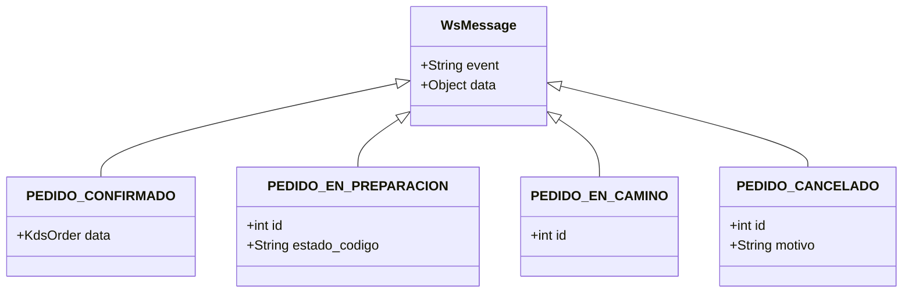

# Technical Specification: Display de Cocina (KDS) y Rol Cocinero

**ID de Cambio**: `08-display-cocina-kds`  
**Autor**: Senior Technical Writer & Systems Analyst  
**Estado**: Especificado (`spec`)  
**Fecha**: 2026-05-21  

---

## 1. Introducción y Contexto Técnico

Esta especificación detalla el diseño de contratos, seguridad e integración para el **Kitchen Display System (KDS)** de la plataforma Food Store. El objetivo primordial es proveer un canal de comunicación reactivo y bidireccional en tiempo real entre el flujo transaccional de pedidos (compra del cliente) y la consola de producción en cocina, operada por el nuevo rol `cocina`.

El sistema requiere:
1. Sincronización en tiempo real mediante un protocolo WebSocket resiliente con fallback inteligente.
2. Controles de seguridad granular (RBAC) tanto en HTTP tradicional como en WebSockets.
3. Restricciones estrictas en la Máquina de Estados Finitos (FSM) de los pedidos auditables mediante logs de transiciones.

---

## 2. Seguridad, RBAC y Máquina de Estados Finitos (FSM)

### 2.1 Modelo de Control de Acceso (RBAC)
Se incorpora el rol **`cocina`** como un actor especializado dentro de la plataforma. La matriz de permisos para los endpoints del KDS se define de la siguiente manera:

| Operación / Endpoint | Rol Cocina | Rol Pedidos | Rol Admin | Rol Cliente |
| :--- | :---: | :---: | :---: | :---: |
| `GET /api/v1/cocina/pedidos` | **Permitido** | **Permitido** | **Permitido** | Denegado (403) |
| `PATCH /api/v1/cocina/productos/{id}/disponibilidad` | **Permitido** | Denegado (403) | **Permitido** | Denegado (403) |
| `PATCH /api/v1/pedidos/{id}/estado` (Transición Cocina) | **Permitido** | **Permitido** | **Permitido** | Denegado (403) |
| `PATCH /api/v1/pedidos/{id}/estado` (Transición General) | Denegado (403) | **Permitido** | **Permitido** | Denegado (403) |
| Conexión WebSocket `WS /api/v1/cocina/ws` | **Permitido** | **Permitido** | **Permitido** | Denegado (403) |

### 2.2 Restricciones de la Máquina de Estados (FSM)
El flujo de transiciones de los pedidos está gobernado por una máquina de estados centralizada. Si el usuario autenticado posee **únicamente** el rol `cocina`, el backend validará que las transiciones solicitadas pertenezcan exclusivamente al subconjunto operativo de cocina:

1. **`CONFIRMADO → EN_PREP`** (Iniciar preparación del pedido).
2. **`EN_PREP → EN_CAMINO`** (Finalizar preparación, pedido listo para despacho).

Cualquier intento por parte de un usuario con rol exclusivo de `cocina` de realizar transiciones fuera de este flujo (como `PENDIENTE → CONFIRMADO`, `EN_CAMINO → ENTREGADO` o cancelaciones en cualquier fase) resultará en un rechazo inmediato de la petición devolviendo un código **HTTP 403 Forbidden**.

### 2.3 Auditoría de Transiciones (`HistorialEstadoPedido`)
Toda transición de estado exitosa debe ser auditada registrando el operario responsable. Cuando un cocinero actualiza el estado de un pedido:
1. El JWT del cocinero se decodifica en el middleware de seguridad para extraer el `usuario_id`.
2. Se inserta un nuevo registro en la tabla `HistorialEstadoPedido` con la siguiente estructura:

| Campo | Tipo de Datos | Descripción |
| :--- | :--- | :--- |
| `id` | Integer (PK) | Identificador único de auditoría. |
| `pedido_id` | Integer (FK) | Relación con el pedido afectado. |
| `estado_codigo` | String | Código del nuevo estado alcanzado (`EN_PREP` o `EN_CAMINO`). |
| `usuario_id` | Integer (FK) | ID del usuario autenticado que operó el cambio (Cocinero). |
| `created_at` | DateTime | Timestamp con zona horaria de la transacción. |
| `motivo` | String (Optional) | Descripción o nota opcional del cambio (ej: `null` en flujos estándar). |

---

## 3. Especificación de Endpoints REST (HTTP)

### 3.1 `GET /api/v1/cocina/pedidos`
Recupera la lista de pedidos activos que deben visualizarse en el display de la cocina. Por definición, incluye únicamente pedidos en estados `CONFIRMADO` y `EN_PREP`, ordenados por antigüedad ascendente (`created_at` del ingreso al estado `CONFIRMADO`) para dar prioridad a los pedidos más antiguos.

* **URL**: `/api/v1/cocina/pedidos`
* **Método**: `GET`
* **Headers requeridos**: `Authorization: Bearer <JWT>`
* **Parámetros de consulta (Query Params)**:
  * `limit` (opcional, integer, default: `50`): Limita la cantidad de registros devueltos.
  * `offset` (opcional, integer, default: `0`): Desplazamiento para paginación.
  * `estado` (opcional, string, default: `null`): Permite filtrar explícitamente por un estado específico (`CONFIRMADO` o `EN_PREP`). Si se omite, se retornan ambos.

#### Esquema de Respuesta JSON (HTTP 200 OK)
```json
[
  {
    "id": 104,
    "numero_pedido": "PED-20260521-004",
    "created_at": "2026-05-21T12:05:00Z",
    "notas": "Sin aderezos en la hamburguesa doble, por favor.",
    "estado_codigo": "CONFIRMADO",
    "detalles": [
      {
        "nombre_snapshot": "Hamburguesa Doble Queso",
        "cantidad": 2,
        "personalizacion": [1, 5]
      },
      {
        "nombre_snapshot": "Papas Fritas Medianas",
        "cantidad": 1,
        "personalizacion": []
      }
    ]
  }
]
```

### 3.2 `PATCH /api/v1/cocina/productos/{id}/disponibilidad`
Permite a la cocina apagar o encender temporalmente la visibilidad de un producto en el catálogo del cliente (por ejemplo, ante quiebre de stock de ingredientes o saturación en horas pico).

* **URL**: `/api/v1/cocina/productos/{id}/disponibilidad`
* **Método**: `PATCH`
* **Headers requeridos**: `Authorization: Bearer <JWT>`
* **Ruta de Parámetro**:
  * `id` (integer, requerido): ID único del producto.

#### Esquema de Petición JSON (Request Body)
```json
{
  "disponible": false
}
```

#### Esquema de Respuesta JSON (HTTP 200 OK)
```json
{
  "id": 42,
  "nombre": "Papas Fritas Medianas",
  "disponible": false,
  "updated_at": "2026-05-21T12:38:00Z"
}
```

### 3.3 `PATCH /api/v1/pedidos/{id}/estado` (Integrado con FSM)
Endpoint centralizado para cambiar el estado de un pedido. Ejecuta validaciones de rol y audita la transición en `HistorialEstadoPedido`.

* **URL**: `/api/v1/pedidos/{id}/estado`
* **Método**: `PATCH`
* **Headers requeridos**: `Authorization: Bearer <JWT>`
* **Ruta de Parámetro**:
  * `id` (integer, requerido): ID único del pedido.

#### Esquema de Petición JSON (Request Body)
```json
{
  "nuevo_estado": "EN_PREP",
  "motivo": null
}
```

#### Esquema de Respuesta JSON (HTTP 200 OK)
```json
{
  "id": 104,
  "numero_pedido": "PED-20260521-004",
  "estado_codigo": "EN_PREP",
  "updated_at": "2026-05-21T12:40:02Z",
  "auditoria": {
    "historial_id": 850,
    "operador_id": 15,
    "operador_rol": "cocina",
    "fecha_transicion": "2026-05-21T12:40:02Z"
  }
}
```

---

## 4. Protocolo WebSocket en Tiempo Real

### 4.1 Conexión y Handshake de Seguridad
La conexión en vivo para la cocina se realiza estableciendo un WebSocket persistente. El KDS frontend debe adjuntar obligatoriamente el token JWT del usuario dentro de los parámetros de consulta para garantizar que la conexión se autentique en la fase inicial del protocolo HTTP Upgrade.

* **URL de Handshake**: `WS /api/v1/cocina/ws?token=<JWT>`

#### Protocolo de Seguridad en Handshake (Backend):
1. **Extracción del Token**: El backend lee el query parameter `token`. Si el parámetro está ausente, rechaza la conexión inmediatamente respondiendo **HTTP 401 Unauthorized** antes del upgrade de protocolo.
2. **Decodificación del JWT**: Se valida la firma del token utilizando la clave secreta `JWT_SECRET` y el algoritmo de hash `HS256`. Si el token expiró, la firma no coincide o está corrupta, se aborta respondiendo **HTTP 401 Unauthorized**.
3. **Autorización RBAC**: Se extraen los roles asignados al usuario desde el payload del JWT. Se comprueba que el usuario cuente con al menos uno de los siguientes roles: `cocina`, `pedidos` o `admin`. Si no posee ninguno, la petición es rechazada con un código **HTTP 403 Forbidden**.
4. **Establecimiento de Conexión**: Tras pasar las validaciones, el backend realiza el upgrade a WebSocket y registra la conexión activa en el `ConnectionManager`.

---

### 4.2 Formatos y Payloads de Eventos de WebSocket
Los mensajes que fluyen desde el servidor hacia la pantalla de cocina se serializan en formato JSON plano. Cada payload cuenta con una estructura discriminada consistente en dos propiedades principales: `event` (nombre del evento en mayúsculas) y `data` (un objeto JSON anidado con los detalles específicos).



#### Evento 1: `PEDIDO_CONFIRMADO`
* **Propósito**: Disparado inmediatamente después de que un pedido ingresa al sistema en estado `CONFIRMADO` (ej: pago aprobado). Permite al KDS insertar dinámicamente la nueva tarjeta en la columna de entrada ("Por preparar") y reproducir la alerta sonora.
* **Payload**:
```json
{
  "event": "PEDIDO_CONFIRMADO",
  "data": {
    "id": 105,
    "numero_pedido": "PED-20260521-005",
    "created_at": "2026-05-21T12:28:10Z",
    "notas": "Entregar rápido, caliente.",
    "estado_codigo": "CONFIRMADO",
    "detalles": [
      {
        "nombre_snapshot": "Pizza Pepperoni Grande",
        "cantidad": 1,
        "personalizacion": []
      }
    ]
  }
}
```

#### Evento 2: `PEDIDO_EN_PREPARACION`
* **Propósito**: Disparado cuando un cocinero (u otro operador autorizado) inicia la preparación de un pedido. El KDS debe mover la tarjeta correspondiente del pedido a la columna de "En preparación".
* **Payload**:
```json
{
  "event": "PEDIDO_EN_PREPARACION",
  "data": {
    "id": 105,
    "estado_codigo": "EN_PREP"
  }
}
```

#### Evento 3: `PEDIDO_EN_CAMINO`
* **Propósito**: Disparado cuando el pedido finaliza su preparación y está listo para ser distribuido. El KDS debe retirar la tarjeta de la interfaz visual de forma definitiva.
* **Payload**:
```json
{
  "event": "PEDIDO_EN_CAMINO",
  "data": {
    "id": 105
  }
}
```

#### Evento 4: `PEDIDO_CANCELADO`
* **Propósito**: Disparado si un administrador o el sistema cancela de forma explícita un pedido que ya se encontraba en cola. El KDS debe remover inmediatamente la tarjeta de la UI para evitar producción innecesaria, alertando de la cancelación visualmente.
* **Payload**:
```json
{
  "event": "PEDIDO_CANCELADO",
  "data": {
    "id": 105,
    "motivo": "Pago rechazado por la entidad bancaria"
  }
}
```

---

## 5. Manejo de Errores (Error Schemas)

Para garantizar consistencia y facilitar el parseo en el cliente frontend, el sistema retorna estructuras normalizadas ante fallos en peticiones REST o conexiones de WebSocket.

### 5.1 HTTP 401 Unauthorized
Retornado si el token JWT no es suministrado, ha expirado o su firma es inválida.
```json
{
  "status_code": 401,
  "error": "Unauthorized",
  "detail": "Token de autenticación inválido o expirado"
}
```

### 5.2 HTTP 403 Forbidden (FSM o Privilegios Insuficientes)
Retornado ante intentos de realizar acciones no autorizadas para el rol del usuario, o cuando la transición del estado del pedido viola las restricciones estrictas de la FSM de cocina.
```json
{
  "status_code": 403,
  "error": "Forbidden",
  "detail": "Transición de estado no autorizada para el rol cocina: CONFIRMADO -> EN_CAMINO. Se requiere iniciar preparación previamente."
}
```

---

## 6. Interfaces TypeScript para Frontend

Las siguientes definiciones en TypeScript deben respetarse estrictamente y ubicarse en el directorio compartido o de cocina del proyecto React (`frontend/src/features/cocina/` o `frontend/src/shared/types/`):

```typescript
/**
 * Detalle específico de un producto dentro de un pedido en KDS.
 */
export interface KdsOrderDetail {
  nombre_snapshot: string;
  cantidad: number;
  personalizacion: number[]; // Array de IDs de ingredientes excluidos por el cliente
}

/**
 * Representa la estructura de un Pedido activo consumible por el Kitchen Display System.
 */
export interface KdsOrder {
  id: number;
  numero_pedido: string;
  created_at: string; // ISO 8601 string formato 'YYYY-MM-DDTHH:mm:ssZ'
  notas: string | null;
  estado_codigo: 'CONFIRMADO' | 'EN_PREP';
  detalles: KdsOrderDetail[];
}

/**
 * Payload de actualización para cambiar la disponibilidad de un producto.
 */
export interface CocinaProductUpdate {
  disponible: boolean;
}

/**
 * Discriminación de Eventos WebSocket
 */

export interface WsOrderConfirmadoEvent {
  event: 'PEDIDO_CONFIRMADO';
  data: KdsOrder;
}

export interface WsOrderEnPreparacionEvent {
  event: 'PEDIDO_EN_PREPARACION';
  data: {
    id: number;
    estado_codigo: 'EN_PREP';
  };
}

export interface WsOrderEnCaminoEvent {
  event: 'PEDIDO_EN_CAMINO';
  data: {
    id: number;
  };
}

export interface WsOrderCanceladoEvent {
  event: 'PEDIDO_CANCELADO';
  data: {
    id: number;
    motivo: string | null;
  };
}

/**
 * Unión discriminada para eventos que fluyen por el WebSocket del KDS.
 */
export type WsEvent =
  | WsOrderConfirmadoEvent
  | WsOrderEnPreparacionEvent
  | WsOrderEnCaminoEvent
  | WsOrderCanceladoEvent;
```

---

## 7. Plan de Verificación Técnica (Pytest & Manual)

De acuerdo con las directrices de **Strict TDD Mode**, no se iniciará el desarrollo de ningún archivo de código hasta que las pruebas unitarias y de integración correspondientes estén escritas y fallen inicialmente.

### 7.1 Pruebas Unitarias e Integración (Backend Pytest)
Se generará el archivo `backend/app/tests/modules/cocina/test_cocina.py` el cual validará:

1. **Pruebas de Transiciones FSM de Cocina**:
   * **Caso 1**: Un usuario con rol exclusivo `cocina` realiza la transición `CONFIRMADO → EN_PREP` en un pedido existente. El test debe comprobar que el estado del pedido en base de datos cambia y retorna HTTP 200.
   * **Caso 2**: El mismo usuario intenta saltar de `CONFIRMADO → EN_CAMINO` directamente. Debe arrojar **HTTP 403 Forbidden** y el pedido debe conservar el estado `CONFIRMADO`.
   * **Caso 3**: Comprobación de que la tabla `HistorialEstadoPedido` guarde un registro correcto y con la vinculación precisa del `usuario_id` del cocinero autenticado al finalizar cada cambio de estado exitoso.

2. **Pruebas de Seguridad en REST**:
   * **Caso 4**: Intentar realizar un `GET /api/v1/cocina/pedidos` con un token JWT del rol `cliente`. Debe arrojar **HTTP 403 Forbidden**.
   * **Caso 5**: Intentar actualizar la disponibilidad de un producto sin pasar encabezado `Authorization`. Debe retornar **HTTP 401 Unauthorized**.

3. **Pruebas de WebSocket Handshake e Integridad**:
   * **Caso 6**: Establecer una conexión de WebSocket simulada (`client.websocket_connect("/api/v1/cocina/ws")`) sin query string de token JWT. Debe abortar la conexión.
   * **Caso 7**: Simular la aprobación de pago de un pedido (transición a `CONFIRMADO`) y verificar de manera concurrente que el canal de WebSocket conectado reciba un evento con el tag `PEDIDO_CONFIRMADO` y el JSON estructurado de forma íntegra tal como describe esta especificación.
